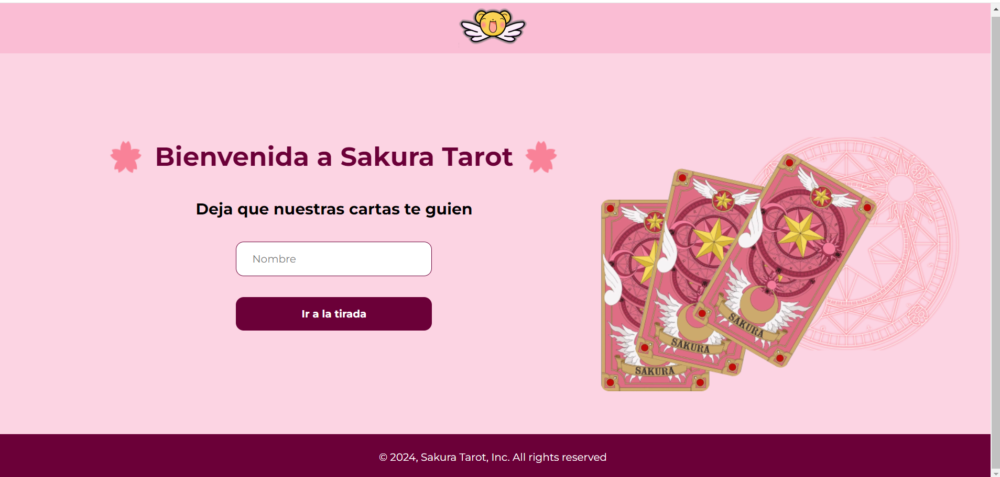
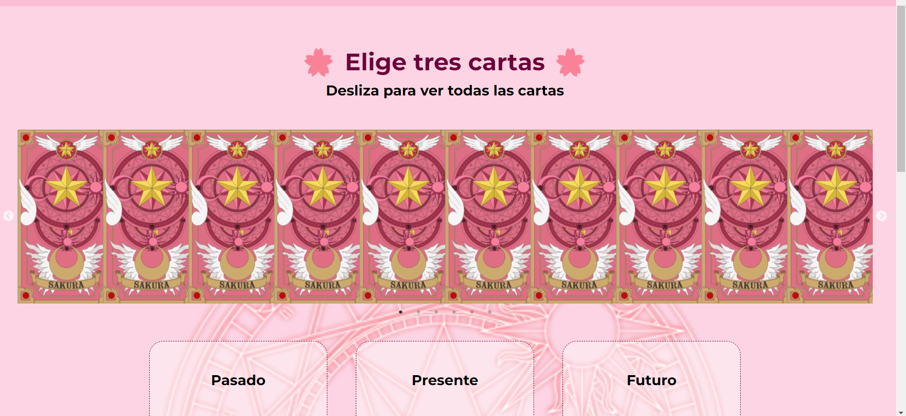
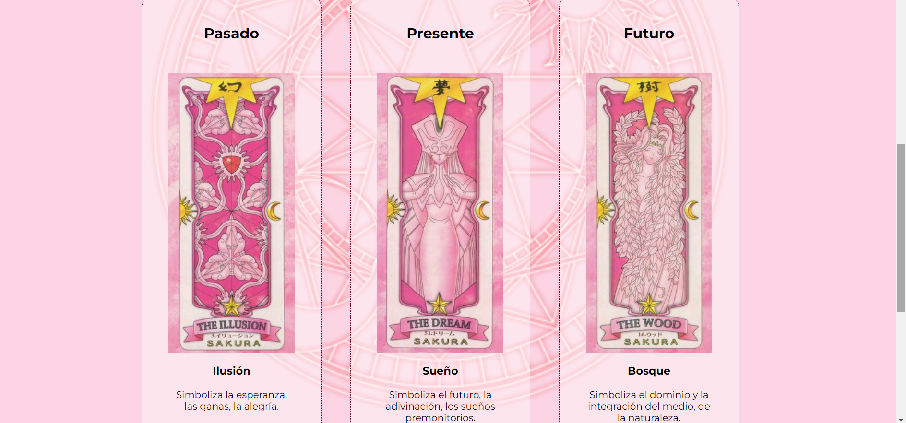

# 🌌 Proyecto de Lectura de Cartas 🌌

## Descripción

Bienvenido a nuestro místico proyecto de lectura de cartas. Esta aplicación web te sumergirá en el fascinante mundo de la adivinación, proporcionando orientación para el pasado, presente y futuro a través de las cartas. Descubre las respuestas que el universo tiene para ti.


## Tecnologías Utilizadas 💻

- 
- 
- 
- 
- 
- 

## Herramientas 🛠
- 
- /

## Funcionalidades Principales ✔️

1. **Mostrar Todas las Cartas Boca Abajo:**
   - Implementado utilizando HTML, CSS y React.js para una presentación clara y estéticamente agradable.

2. **Seleccionar Tres Cartas:**
   - Funcionalidad en Javascript que permite al usuario elegir exactamente tres cartas.

3. **Asignar Cartas a Pasado, Presente y Futuro:**
   - Interfaz que permite al usuario asignar cada carta a una posición específica.

4. **Mostrar Significado de Cada Carta:**
   - Despliegue del significado de cada carta en la interfaz de usuario.

5. **Guardar Lecturas Realizadas (Historial):**
   - Utilización de Json-server para almacenar las lecturas realizadas.

6. **Guardar Fecha y Nombre de Usuario:**
   - Registro automático de la fecha y posibilidad de introducir o actualizar el nombre de usuario.

7. **Actualizar Información de Nombre de Usuario:**
   - Funcionalidad para cambiar el nombre de usuario asociado a las lecturas guardadas.

8. **Eliminar Lectura Guardada Seleccionada:**
   - Interfaz que permite al usuario eliminar lecturas específicas.

9. **Vaciar Historial de Lecturas Guardadas:**
   - Función para eliminar todas las lecturas guardadas con una confirmación.

## Instrucciones de Configuración y Ejecución 🚀

1. Clona este repositorio a tu máquina local con el siguente comando: "git clone https://github.com/zohra-b/Sakura-Tarot.git" .
2. Instala las dependencias usando `npm install`.
3. Inicia la aplicación con `npm start`.
4. Inicia el servidor Json con `json-server --watch db.json`.

## ¡Explora el Universo de las Cartas y Descubre tu Destino! 🔮✨

Con estos pasos, los usuarios podrán disfrutar de una experiencia de lectura de cartas intuitiva y personalizada. ¡Esperamos que encuentren orientación y claridad en sus consultas! 🌟

## ## Vista Previa 🌠 📸


 


## Autoras 👩‍💻

Este proyecto fue creado con amor y pasión por:

- [Nombre de la Autora](enlace_a_perfil_linkedin)
   - [LinkedIn](enlace_a_perfil_linkedin)

- [Otro Nombre de Autora](enlace_a_perfil_linkedin)
   - [LinkedIn](enlace_a_perfil_linkedin)
- [Nombre de la Autora](enlace_a_perfil_linkedin)
   - [LinkedIn](enlace_a_perfil_linkedin)

- [Gabriela Irimia](https://www.linkedin.com/in/gabriela-irimia/)
   - [LinkedIn](https://www.linkedin.com/in/gabriela-irimia/)

   - [Nombre de la Autora](enlace_a_perfil_linkedin) 
   - [LinkedIn](enlace_a_perfil_linkedin)

- [Otro Nombre de Autora](enlace_a_perfil_linkedin) 
   - [LinkedIn](enlace_a_perfil_linkedin)

## Estructura del Proyecto 🏗️

```plaintext
sakura-tarot
|-- public/
|   |-- images/
|       |-- card-back.png
|       |-- carousel-icon.png
|       |-- cursor-img.png
|       |-- hero-img.png
|       |-- logo-sakura.png
|       |-- ornament-bg.png
|       |-- sakura-ornament.png
|
|-- src/app
|   |-- assets/data
|   |   |-- db.json
|   |   
|   |-- componentes/
|   |   |--Button
|   |   |--Card
|   |   |--CardsContainer
|   |   |--Carousel
|   |   |--Footer
|   |   |--Form
|   |   |--Header
|   |   |--HistTable
|   |   |--Input
|   |   |--Historial
|   |   
|   |-- Services/
|   |   |--historial.jsx
|   |   |-- sakuraApi.jsx
|   |-- Tirada
|   |   |--page.jsx
|   |
|   |   |--layout.jsx
|   |   |--page.jsx(Home)
|   |
|   |-- gitignore
|   |-- jsconfig.js
|   |-- next.config.js
|   |-- package-lock.json
|   |-- package.json
|   |--README.md